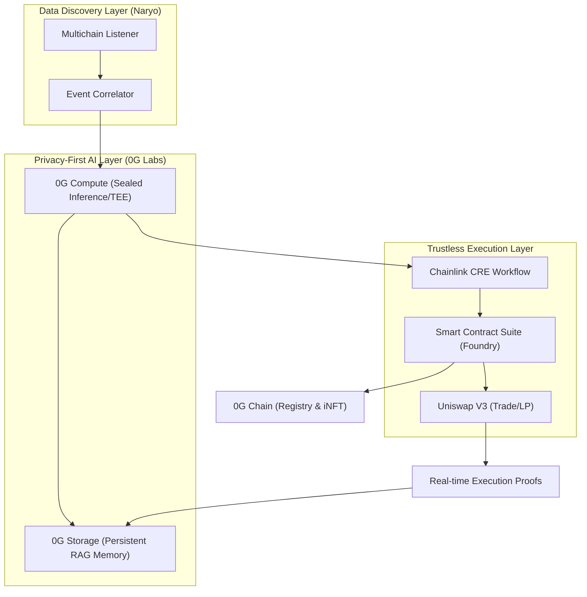

# 🌌 ORION: Privacy-First AI Agent for Decentralized Finance

**ORION** (Open Robust Intelligence & On-chain Network) is a cutting-edge AI Agent that brings **Sealed Privacy** and **Autonomous Intelligence** to DeFi trading. Built for the **0G Hackathon**, ORION leverages the 0G Labs ecosystem to ensure that high-alpha trading strategies remain confidential while executing permissionless swaps on Unichain and Ethereum.

---

## 🎨 Architecture Overview



---

## 🏛️ Smart Contract Suite

The system's on-chain integrity is anchored by a set of Solidity contracts (Foundry-native):

- **AgentRegistry.sol**: Manages the decentralized directory of AI agents and their privacy settings.
- **INFT.sol**: Implements ERC-7857 for agent ownership and metadata composability.
- **PrivacyVault.sol**: Handles shielded capital routing for private trade execution.
- **StrategyVault.sol**: Persists AI-generated strategies with cross-chain verifiable proofs.

---

## 🛡️ Hackathon Module Integrations

ORION is a complete end-to-end integration of the following sponsor modules:

### 1. 🧊 0G Compute (Sealed Inference)
All investment reasoning is executed within **Trusted Execution Environments (TEEs)** via 0G Compute. This protects the agent's "Alpha" from front-runners and centralized surveillance.

### 2. 🗄️ 0G Storage (Decentralized RAG)
ORION persists its analytical memory and historical decisions on the **0G Storage Network**. This allows for Retrieval-Augmented Generation (RAG) that is geographically distributed and tamper-proof.

### 3. 🦄 Uniswap V3 (Liquidity Manager)
Autonomous pool discovery, liquidity provision (LPing), and intelligent routing are handled natively through the Uniswap V3 SDK on **Unichain Sepolia**.

### 4. 🔗 Chainlink CRE (Workflow Orchestration)
The **Chainlink Custom Runtime Environment (CRE)** orchestrates the handoff between AI analysis and on-chain execution, ensuring data integrity at every step.

---

## 🚀 Quick Start (Demo Mode)

To witness the agent's full potential without spending real testnet tokens:

1.  **Install dependencies**:
    ```bash
    npm install
    ```
2.  **Follow the [A-Z Setup Guide](GUIDE.md#️-environment--system-setup-a-z)** to configure your `.env`.
3.  **Run the dry-run Pool Screener**:
    ```bash
    npx ts-node src/cli.ts analyze-pools --file examples/pools.json --dry-run
    ```

---

## 🕹️ CLI Command Reference

ORION comes with a powerful command suite:

| Command | Description |
| :--- | :--- |
| `analyze` / `analyze-pools` | 0G AI comparative analysis of multiple liquidity pools. |
| `start` | Professional live mode listening for real swap events. |
| `balance` | View wallet assets (ETH, USDC) and Uniswap V3 LP NFTs. |
| `withdraw-pool` | Exit any LP position by ID and collect all fees. |
| `mint-inft` | Register the agent's soul as an ERC-7857 iNFT on 0G Chain. |

---

## 🔧 Self-Healing Reliability

ORION is designed for the real world. If the 0G Galileo Testnet experiences high load (503 errors), the agent **automatically self-heals** by switching to a **Local Sealed Strategy Engine**, ensuring that your liquidiy management never goes offline.

---

**Developed for the 0G Hackathon | Decentralized AI Era.**
